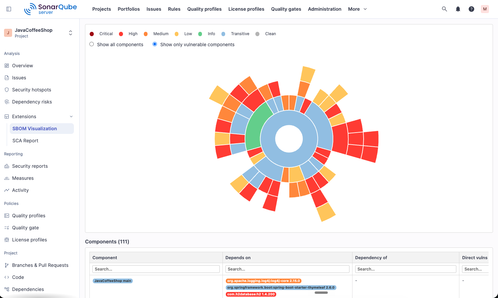
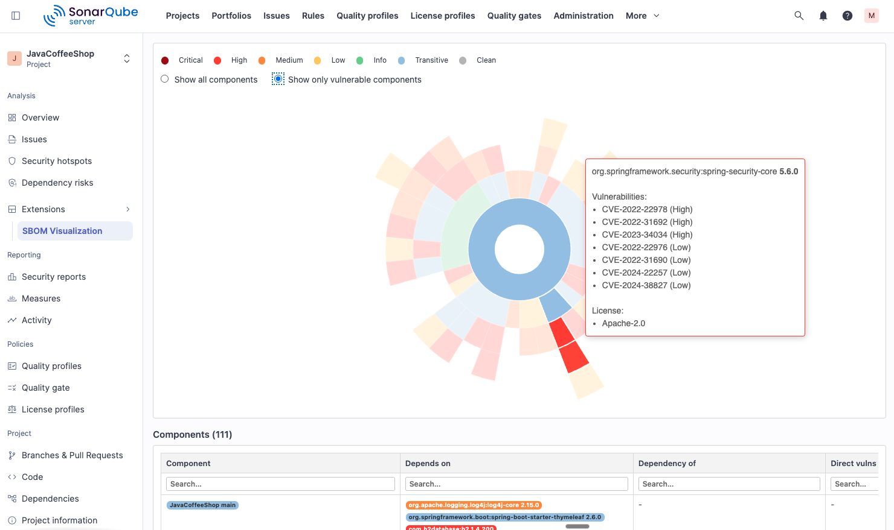

# SonarQube SBOM Visualization Plugin

 [](https://sonarcloud.io/summary/new_code?id=mathiasconradt_sonarqube-sbom-visualization-plugin)

A SonarQube plugin that brings the [CycloneDX Sunshine](https://github.com/CycloneDX/Sunshine) SBOM visualization directly into SonarQube, per project.

For each project it fetches the CycloneDX SBOM and dependency risk (CVE) data from SonarQube's SCA API, merges the vulnerability data into the SBOM, and renders the full Sunshine interactive visualization — sunburst dependency chart, components table, and vulnerabilities table — inside SonarQube.

## Disclaimer

This is a community plugin. It is not an official plugin provided by Sonar, nor is it supported by Sonar. It has been tested with SonarQube Server 2026.1 and later releases.

This plugin is only useful for SonarQube Server Enterprise Edition instances that also have Sonar Advanced Security enabled. It relies on Sonar's SCA APIs for CycloneDX SBOM and dependency risk data, so projects must be analyzed with Software Composition Analysis available.

## Screenshots





## Requirements

- SonarQube 2026.x (uses plugin API 12.x)
- SonarQube SCA (Software Composition Analysis) enabled and projects analyzed
- Java 17+ (build)
- Maven 3.8+ (build)

## How it works

1. A SonarQube token is stored once via the plugin's admin page.
2. When a user opens the **SBOM Visualization** tab on a project, the plugin lists available branches and pre-selects the default branch. For the selected branch it calls:
   - `GET /api/v2/sca/sbom-reports?component={key}&type=cyclonedx&branch={branch}` — the CycloneDX SBOM
   - `GET /api/v2/sca/risk-reports?component={key}&branch={branch}` — dependency vulnerability risks
   - `GET /api/project_analyses/search?project={key}&branch={branch}&ps=1` — last scan timestamp (for cache validation)
3. The Java backend merges CVE/risk data into the SBOM by matching `packageUrl` (purl), then caches the result on the server filesystem. Subsequent loads for the same project/branch are served from cache as long as no new scan has run.
4. The enriched CycloneDX JSON is passed to a JavaScript port of the Sunshine visualization engine, which renders:
   - A branch selector dropdown (default branch pre-selected)
   - A **↺ Refresh** button that bypasses the cache and forces regeneration
   - An interactive sunburst chart of all dependencies, color-coded by highest vulnerability severity
   - A toggle to show only vulnerable components
   - Last scan and visualization generation timestamps (in browser local timezone)
   - A searchable, paginated components table with dependency relationships, direct/transitive vulnerabilities, and licenses
   - A searchable, paginated vulnerabilities table with affected components

## Build

```bash
mvn package
```

The plugin JAR is written to `target/sonarqube-cdx-sunshine-plugin-<version>.jar`.

## Deploy

### Standard

Copy the JAR to SonarQube's plugins directory and restart:

```bash
cp target/sonarqube-cdx-sunshine-plugin-*.jar $SONARQUBE_HOME/extensions/plugins/
# restart SonarQube
```

### Docker

If SonarQube runs in Docker with a named `sonarqube_extensions` volume:

```bash
mvn package

docker cp target/sonarqube-cdx-sunshine-plugin-*.jar \
  sonarqube:/opt/sonarqube/extensions/plugins/

docker restart sonarqube
```

`/opt/sonarqube/extensions/plugins/` sits on the `sonarqube_extensions` named volume, so it remains writable even when the container runs with `read_only: true`.

To remove the plugin:

```bash
docker exec sonarqube rm /opt/sonarqube/extensions/plugins/sonarqube-cdx-sunshine-plugin-*.jar
docker restart sonarqube
```

## Configuration

1. Log in to SonarQube as admin.
2. Go to **Administration → Configuration → SBOM Visualization**.
3. Enter a SonarQube token with permission to read project SBOM and SCA data and click **Save**.

The token is stored as a global SonarQube setting (`sbomviz.sonar.token`).

## Pages

| Page | Location in SonarQube |
|------|-----------------------|
| Token configuration | Administration → Configuration → SBOM Visualization |
| Per-project visualization | Project → Analysis → SBOM Visualization |

## License

Licensed under the **Apache License, Version 2.0** — see [LICENSE](LICENSE).

### Third-party components

**Visualization logic** — [`src/main/resources/static/project.js`](src/main/resources/static/project.js) is a JavaScript port of the Python implementation from [CycloneDX Sunshine](https://github.com/CycloneDX/Sunshine):

> Copyright (c) OWASP Foundation. All Rights Reserved.
> SPDX-License-Identifier: Apache-2.0

**Chart library** — [`src/main/resources/static/echarts.min.js`](src/main/resources/static/echarts.min.js) is [Apache ECharts](https://echarts.apache.org/):

> Copyright (c) Apache Software Foundation.
> SPDX-License-Identifier: Apache-2.0
